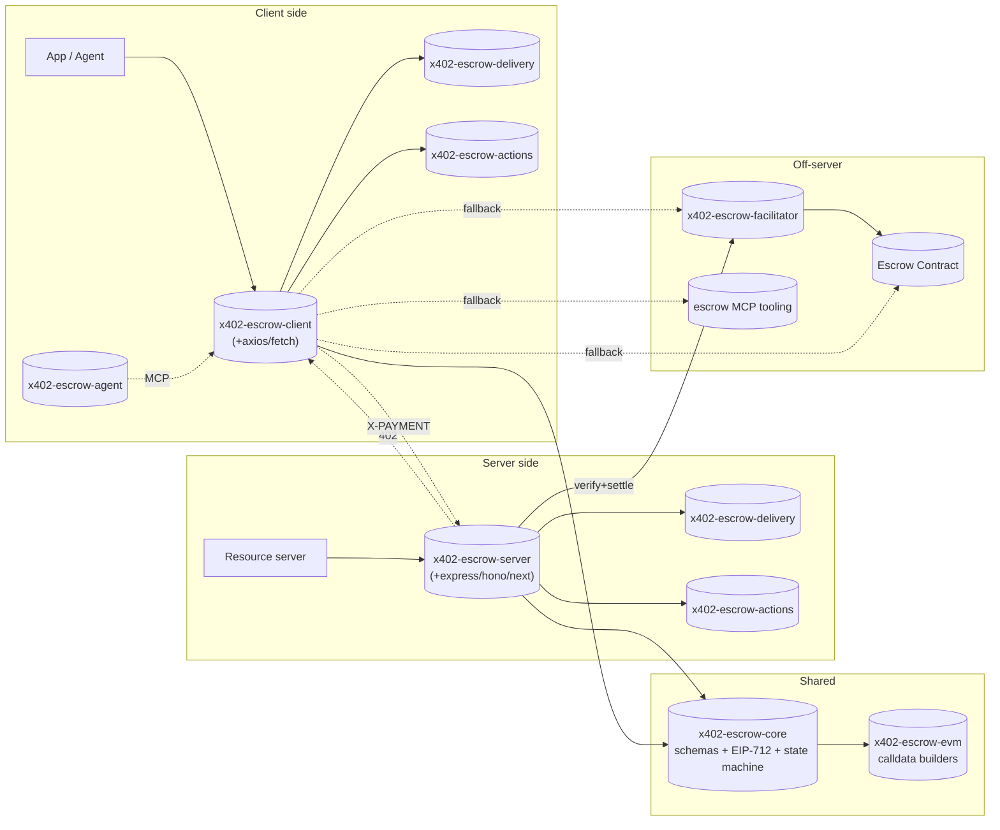

# 00 — Overview

> **Status:** detailed spec (v0.1). Read the [README](./README.md) first for the rationale.

## What the `escrow` scheme is

The `escrow` scheme is a first-class x402 payment scheme that replaces the trusted-server payment model of `exact` with **non-custodial on-chain escrow**. Funds enter an escrow contract at commit time; they release to the seller only after the buyer signals delivery (or the dispute window expires); a registered third-party dispute resolver can split funds and penalize a non-delivering seller.

The server signs an `OfferCommitment` and returns it in the 402 response — no per-offer on-chain setup is required before the first request arrives. Sellers may pre-create offers with a fixed price, or build the offer on demand per request: because the commitment is signed off-chain at HTTP time, the price (and any other offer terms) can reflect the specific session, the requested resource, the buyer's identity, or real-time conditions. Both patterns are valid.

The facilitator is optional. The buyer is never stranded: if a server goes offline or a facilitator stops responding, every non-terminal state still exposes at least one buyer-reachable direct `onchain` path via `nextActions`. Each server response carries a `nextActions` envelope listing the available channels for legal next steps, including that required direct `onchain` route.

The scheme is a **backward-compatible addition** to x402. Servers add an `escrow` entry to their `accepts[]` array; clients that understand the `escrow` scheme handle it; clients that don't fail cleanly with a structured `UnsupportedSchemeError` — never an accidental settle.

---

## Design philosophy: normative wire format, implementation-defined escrow

The `escrow` scheme standardises **how buyer and seller communicate over HTTP**. It does not standardise the escrow contract itself. Specifically:

**Normative** (every conforming implementation must follow):
- The shape of `PaymentRequirements` and `PaymentPayload` (see [01-escrow-scheme.md](./01-escrow-scheme.md))
- The four token-auth strategies: `none`, `erc3009`, `permit`, `permit2`
- The `nextActions` envelope structure and channel registry
- The single censorship-resistance invariant: for every non-terminal state, at least one `onchain` channel MUST exist in `nextActions`
- The meta-tx replay protection requirement: the escrow contract MUST enforce a per-buyer nonce

**Implementation-defined** (each implementation chooses):
- The escrow contract and its on-chain mechanics
- The `offer.commitment` structure
- The specific states and transitions in the exchange lifecycle
- The dispute resolution mechanism and its participants
- The meta-tx EIP-712 type and entry-point method

This separation is what makes the scheme composable: a client that speaks `scheme: "escrow"` can drive **any** conforming escrow implementation without a code update — it reads `nextActions` rather than hard-coding state transitions. A simple two-state escrow and a full dispute-capable voucher escrow are equally valid implementations; the client drives both identically.

Action IDs carry an implementation-defined prefix (e.g. `boson-`, `coinbase-`) to allow multiple implementations to coexist. Clients that encounter an unrecognized prefix skip that action safely — they never misfire.

---

## Architecture at a glance

---

## Package map

The logical package roles below are implementation-agnostic. Reference implementations MAY use any package names — `x402-escrow-*` is used here as a namespace convention, not a requirement.

| Logical package | Purpose |
|---|---|
| `x402-escrow-core` | `escrow` scheme JSON schemas + TypeScript types; EIP-712 helpers for OfferCommitment, meta-tx envelope, and the four EVM token-auth strategies (ERC-3009, EIP-2612 Permit, Permit2, plain approve); exchange state machine model. |
| `x402-escrow-evm` | EVM-specific calldata builders for the commit-only and commit-and-release actions, and the meta-tx envelope that carries them. |
| `x402-escrow-server` | Framework-agnostic resource server. 402 builder, OfferCommitment signer (called per-request for dynamic pricing), delivery negotiator, `nextActions` emitter, post-commit endpoint set. Adapter sub-packages for popular frameworks. |
| `x402-escrow-client` | Framework-agnostic client. Interceptor that parses the 402, picks a delivery option and a token-auth strategy, signs the meta-tx + token authorization, retries, then drives post-commit actions through whichever channel is preferred. |
| `x402-escrow-facilitator` | Reference verify + settle service. Submits the buyer's meta-tx to the escrow contract and pays gas. Stateless w.r.t. funds — never custodies tokens. |
| `x402-escrow-delivery` | Pluggable `DeliveryTransport` interface + atomic / email / XMTP / webhook / IPFS-pointer implementations. |
| `x402-escrow-actions` | Exchange state machine + channel registry. Powers the `nextActions` envelope on every server response. Implementation-specific action tables plug in here. |
| `x402-escrow-agent` | Thin glue layer for AI-agent clients. Bridges to MCP tooling and lets agents pick channel (server / facilitator / on-chain / MCP) per action. |

---

## Spec document map

| # | File | Status |
|---|---|---|
| 00 | [overview.md](./00-overview.md) | detailed (this file) |
| 01 | [escrow-scheme.md](./01-escrow-scheme.md) | detailed |
| 02 | [flows.md](./02-flows.md) | detailed |
| 03 | [delivery-transports.md](./03-delivery-transports.md) | detailed |
| 04 | [state-machine-and-next-actions.md](./04-state-machine-and-next-actions.md) | detailed |
