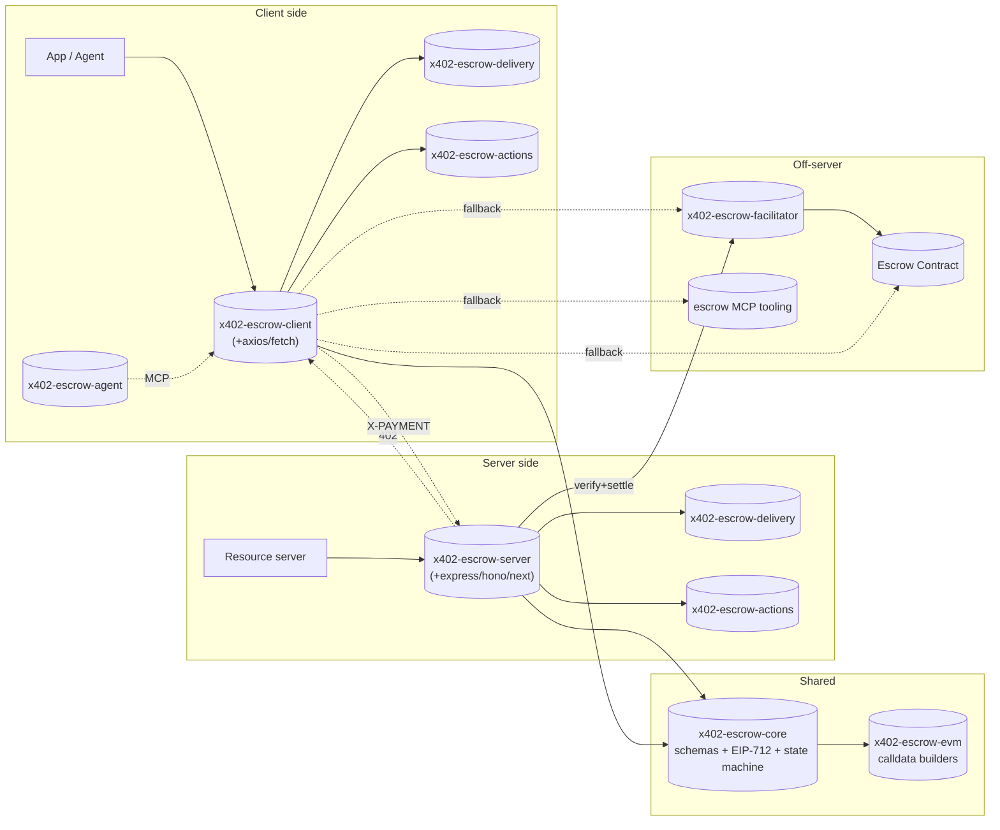

# 00 — Overview

> **Status:** detailed spec (v0.1). Read the [README](./README.md) first for the rationale.

## What the `escrow` scheme is

The `escrow` scheme is a first-class x402 payment scheme that replaces the trusted-server payment model of `exact` with **non-custodial on-chain escrow**. Funds enter an escrow contract at commit time; they release to the seller only after the buyer signals delivery (or the dispute window expires); a registered third-party dispute resolver can split funds and penalize a non-delivering seller.

The scheme is designed so that **existing x402 servers and clients can adopt it without modification**. Servers add an `escrow` entry to their `accepts[]` array; clients that understand the `escrow` scheme handle it; clients that don't fail cleanly with a structured `UnsupportedSchemeError` — never an accidental settle.

## Architecture at a glance

## Package map

Reference implementations MAY use any package names. The logical roles are:

| Logical package | Purpose |
|---|---|
| `x402-escrow-core` | `escrow` scheme JSON schemas + TypeScript types; EIP-712 helpers for OfferCommitment, meta-tx envelope, and the four EVM token-auth strategies (ERC-3009, EIP-2612 Permit, Permit2, plain approve); exchange state machine model. |
| `x402-escrow-evm` | EVM-specific calldata builders for the commit-only and commit-and-release actions, and the meta-tx envelope that carries them. |
| `x402-escrow-server` | Framework-agnostic resource server. 402 builder, OfferCommitment signer wrapper, delivery negotiator, `nextActions` emitter, post-redeem endpoint set. Adapter sub-packages for popular frameworks. |
| `x402-escrow-client` | Framework-agnostic client. Interceptor that parses the 402, picks a delivery option and a token-auth strategy, signs the meta-tx + token authorization, retries, then drives post-commit actions through whichever channel is preferred. |
| `x402-escrow-facilitator` | Reference verify + settle service. Submits the buyer's meta-tx to the escrow contract and pays gas. |
| `x402-escrow-delivery` | Pluggable `DeliveryTransport` interface + atomic / email / XMTP / webhook / IPFS-pointer implementations. |
| `x402-escrow-actions` | Exchange state machine + channel registry. Powers the `nextActions` envelope on every server response. |
| `x402-escrow-agent` | Thin glue layer for AI-agent clients. Bridges to MCP tooling and lets agents pick channel (server / facilitator / on-chain / MCP) per action. |

## Spec document map

| # | File | Status |
|---|---|---|
| 00 | [overview.md](./00-overview.md) | detailed (this file) |
| 01 | [escrow-scheme.md](./01-escrow-scheme.md) | detailed |
| 02 | [flows.md](./02-flows.md) | detailed |
| 03 | [delivery-transports.md](./03-delivery-transports.md) | detailed |
| 04 | [state-machine-and-next-actions.md](./04-state-machine-and-next-actions.md) | detailed |
