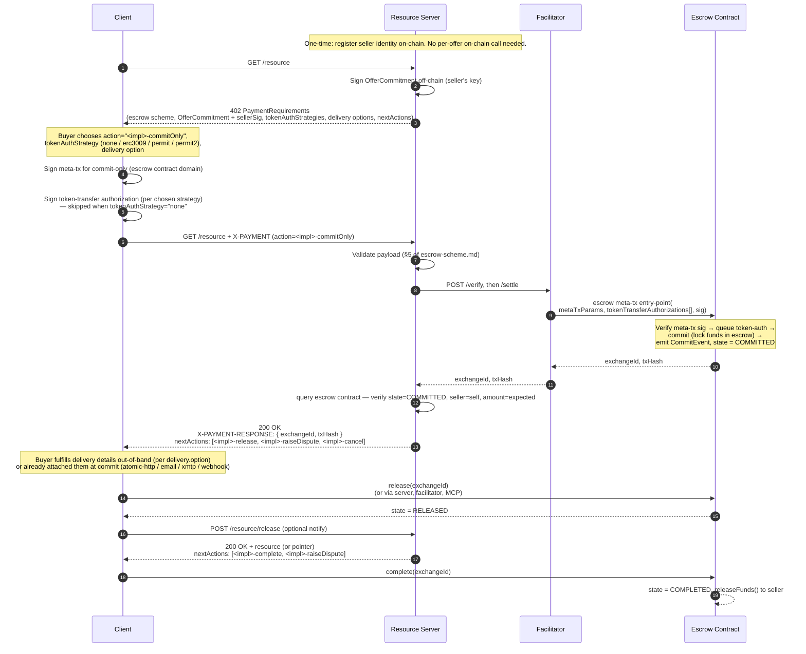
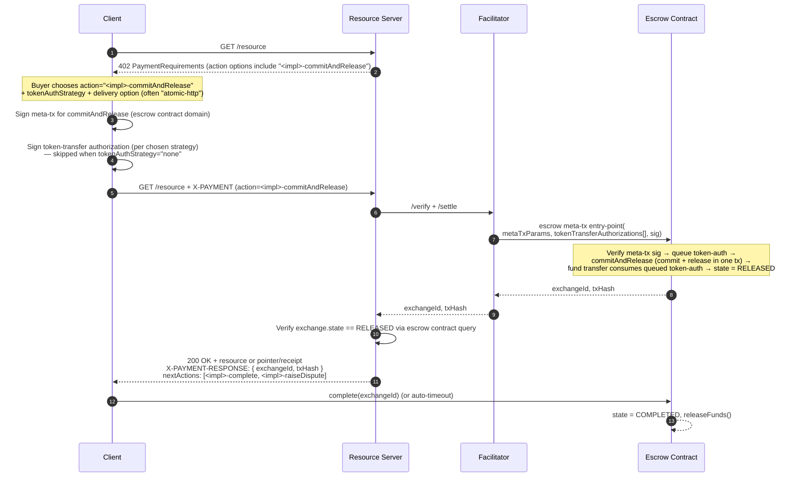
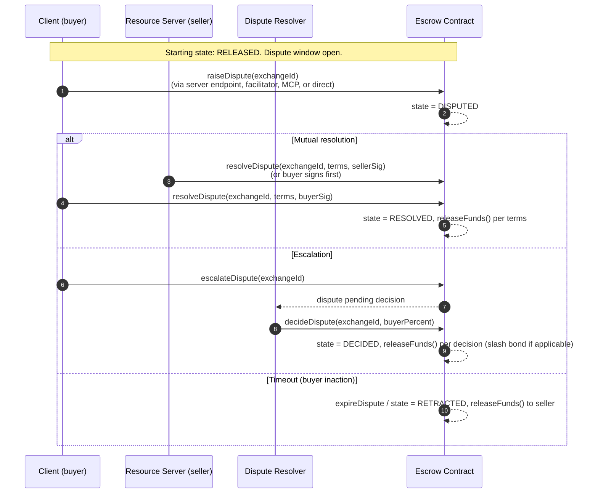
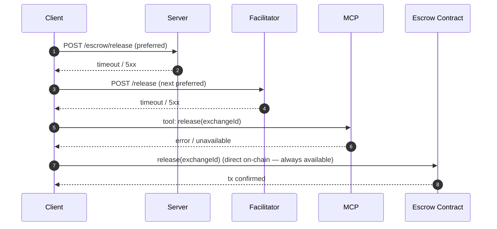

# 02 — Flows

> **Status:** detailed spec (v0.1). Sequence diagrams are the canonical source for the implementation.

## Flow A — Deferred commit (commit now, release later)

The buyer commits to a freshly-created offer, takes a voucher, and releases separately when ready. Use this when the buyer wants to inspect the offer state on-chain before releasing, or when the resource isn't ready at commit time (physical goods, asynchronous services).

Notes:

- The single facilitator call is the escrow contract's meta-tx entry-point, which queues the token-auth into transient storage; the underlying commit function consumes the queued auth during fund transfer.
- The buyer can switch to releasing via the server, the facilitator, MCP, or directly on-chain — `nextActions` lists each available channel.

## Flow B — Atomic commit-and-release (single transaction)

The buyer collapses the **commit** and **release** state transitions into a single on-chain transaction. This is purely a choice about *when the on-chain release happens*; it is **independent of when the actual resource is delivered**.

Use Flow B when the buyer wants to assert "consider this released now" up front. Common cases:

- Atomic delivery — the resource is returned in the same HTTP 200 response (e.g. a small JSON payload, a license key, a signed access token).
- Asynchronous delivery — the resource takes time to produce (e.g. a generated report) but the buyer is happy to release on commit and receive the deliverable later through whichever delivery transport they negotiated. The post-200 dispute window is the buyer's protection if delivery never arrives.
- Pre-staged delivery — the resource is already available off-chain (IPFS, gated URL) and the release is just the on-chain proof.

The mechanics are identical regardless of delivery timing — the escrow contract's commit-and-release entry-point handles the on-chain side, and the chosen `delivery.option` handles the delivery side.

Notes:

- The commit-and-release entry-point emits CommitEvent and ReleaseEvent in a single tx. The committer (and thus the releaser) is `_msgSender()` of the meta-tx — the buyer recovered from the meta-tx signature — so no extra release signature is needed.
- Dispute window still applies post-release; see Flow C.

## Flow C — Dispute path

The buyer raises a dispute within the dispute window. Either party can attempt mutual resolution; if unresolved, escalation invokes the registered dispute resolver.

The buyer reaches the dispute primitives through whichever channel `nextActions.fallback` advertises. The server's convenience endpoint is one option; the others are facilitator, on-chain direct, MCP, XMTP-to-seller. See [04-state-machine-and-next-actions.md](./04-state-machine-and-next-actions.md) for the full channel registry.

## Flow D — Channel fallback (when the server is unreachable)

After the initial 402, every subsequent step has an off-server alternative. Concrete fallback ordering for a "release" action when the server endpoint is offline:

Order is set by `nextActions[i].channels[]` in the most recent server response (or, after server loss, by `requirements.actions.fallback`). The client SDK exposes a `tryAllChannels()` helper that walks the list and returns on the first success.

## Verification points (per flow)

| Flow | Server-side verify | Client-side verify |
|---|---|---|
| A. Deferred commit | `state === COMMITTED`, `seller === self`, `exchangeToken === asset`, `price === amount` | `txHash` mined, exchange ID matches expected offerCommitment hash |
| B. Atomic commit-and-release | `state === RELEASED`, all of the above | CommitEvent + ReleaseEvent in one receipt. Delivery may still be asynchronous — the buyer tracks it via the chosen `delivery.option`. |
| C. Dispute | state transitions match invoked function | event log signatures match the action |
| D. Fallback | n/a | each channel returns a structured success or moves to the next |
