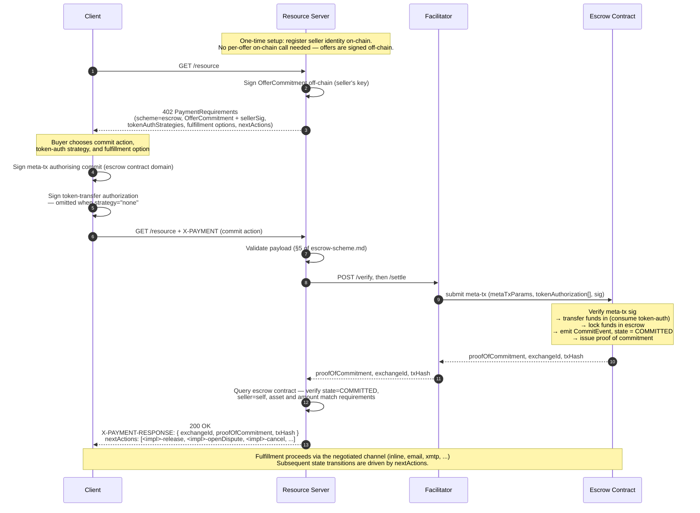
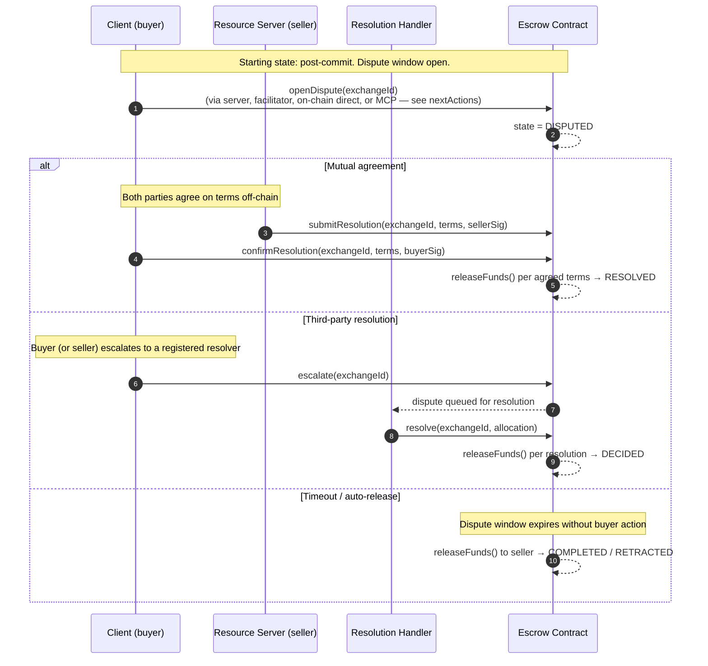
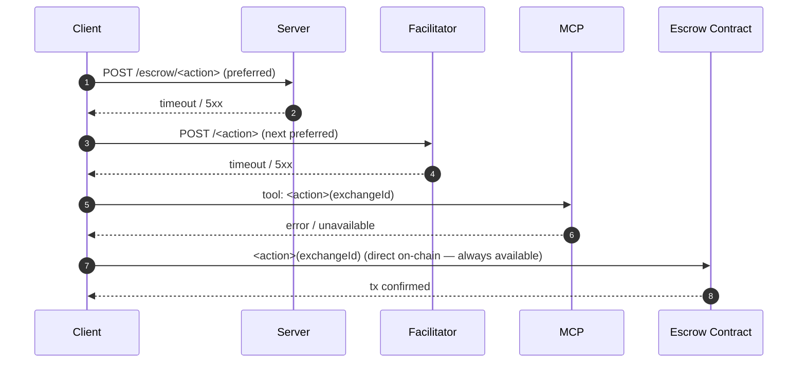

# 02 — Flows

> **Status:** detailed spec (v0.1). Sequence diagrams are the canonical source for the implementation.

## Flow A — Commit and escrow

The buyer commits to a signed offer; funds are locked in the escrow contract; the escrow contract issues a **proof of commitment** (an implementation-defined on-chain record — e.g. a receipt hash, an NFT voucher, an exchange ID). The server verifies the on-chain state and returns the resource or a delivery receipt. All subsequent steps — delivery confirmation, fund release, and dispute resolution — are driven by the `nextActions` envelope returned with every response.

Notes:

- **Proof of commitment** is implementation-defined. It may be an NFT voucher (tradable on secondary markets before redemption), a plain exchange ID, or any on-chain record that proves the buyer's committed stake. The client MUST persist it for subsequent actions.
- The facilitator call is the escrow contract's meta-tx entry-point. The inner commit function locks funds atomically using the queued token-transfer authorization.
- All subsequent actions (delivery confirmation, fund release, dispute) use the `nextActions` envelope. The buyer can invoke any action through any advertised channel — server, facilitator, on-chain direct, MCP, or XMTP — without depending on the server remaining available.
- Whether the resource is fulfilled inline (in the same HTTP 200 body) or asynchronously (via email, XMTP, webhook, etc.) is governed by the negotiated `fulfillment.option`, not by this flow. The on-chain commit and fulfillment are independent dimensions.

## Flow B — Dispute and resolution

After the buyer has committed and the delivery window opens, the buyer may open a dispute if delivery fails or is unsatisfactory. The `escrow` scheme requires that every implementation support at least one resolution method reachable by the buyer on-chain, independently of the seller's server. The specific resolution mechanism is implementation-defined.

Notes:

- **The resolution mechanism is implementation-defined.** An implementation may support only mutual agreement, only a third-party resolver, or both. It may enforce a seller bond that can be slashed on bad delivery. All that this schema requires is that a resolution path exists, that it is reachable on-chain without the seller's cooperation, and that it is described in the `nextActions` envelope.
- The buyer MUST be able to open a dispute directly on-chain (via `onchain` channel) without needing the seller's server. Censorship resistance is a protocol guarantee.
- Timeout behaviour (auto-release to the seller when the buyer does nothing within the dispute window) is recommended but implementation-defined.

## Flow C — Channel fallback (when the server is unreachable)

After the initial 402, every subsequent step has an off-server alternative. Concrete fallback ordering for any post-commit action when the server endpoint is offline:

Order is set by `nextActions[i].channels[]` in the most recent server response (or, after server loss, by `requirements.actions.fallback`). The client SDK exposes a `tryAllChannels()` helper that walks the list and returns on the first success.

## Verification points (per flow)

| Flow | Server-side verify | Client-side verify |
|---|---|---|
| A. Commit and escrow | `state === COMMITTED`, `seller === self`, `exchangeToken === asset`, `price === amount` | `txHash` mined; `proofOfCommitment` matches expected OfferCommitment hash |
| B. Dispute and resolution | state transitions match invoked resolution method | event log entries match the resolution path taken |
| C. Fallback | n/a | each channel returns a structured success or moves to the next |
