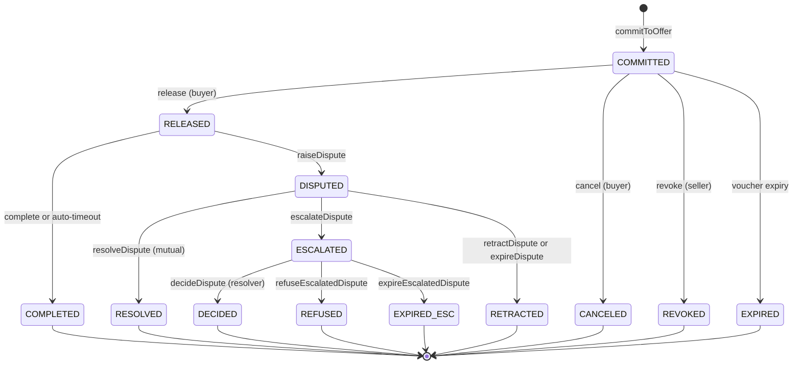

# 04 — State Machine & `nextActions`

> **Status:** detailed spec (v0.1). Defines how the protocol stays self-describing across responses and how the buyer is never locked into the seller's HTTP server.

## Why every response carries `nextActions`

The `escrow` scheme is more than a single round-trip. After commit, the buyer can release, raise a dispute, complete the exchange, and so on — across multiple round-trips potentially over hours or weeks. A long-lived protocol where the server unilaterally decides "what's next" risks two failure modes:

1. **Censorship:** if the server refuses to forward a buyer's release or dispute request, the buyer is stuck.
2. **Stale clients:** SDKs hard-code the state machine and break when the protocol grows.

The fix: every server response carries a top-level `nextActions` envelope listing the legal transitions from the current exchange state and **every channel through which the buyer can invoke each transition** — server endpoint, facilitator, on-chain direct, MCP, XMTP, etc. The client picks any. If one channel fails, the client falls back to the next.

## Exchange state machine



For each *non-terminal* state, the SDK derives the legal next actions from this graph. The 402 itself targets the implicit "pre-commit" state and offers `<impl>-commitOnly` / `<impl>-commitAndRelease`.

## `nextActions` envelope

Every server response (the initial 402, the 200 after commit, the 200 after release, after dispute, …) includes:

```jsonc
"nextActions": {
  "exchangeId": "12345",                  // omitted on the initial 402
  "state": "RELEASED",                    // omitted on the initial 402
  "next": [
    {
      "id": "<impl>-complete",
      "channels": ["server", "facilitator", "onchain", "mcp"],
      "endpoints": { "server": "https://seller.example/escrow/complete" },
      "deadline": "2026-05-11T00:00:00Z"  // optional, absolute
    },
    {
      "id": "<impl>-raiseDispute",
      "channels": ["server", "facilitator", "onchain", "mcp", "xmtp"],
      "endpoints": { "server": "https://seller.example/escrow/dispute/raise" },
      "deadline": "2026-05-11T00:00:00Z"
    }
  ],
  "fallback": {
    "xmtp": "0xSellerXMTP...",
    "mcp":  "escrow://seller/12345",
    "onchainHints": {
      "escrowContract": "0xEscrowContract..."
      // implementation-specific facet/method hints may be included here
    }
  }
}
```

The envelope sits at the top level of the JSON response body. For the initial 402 it's nested inside the `accepts[i].actions` field (since there's no exchangeId yet) — see [01-escrow-scheme.md](./01-escrow-scheme.md) §2.

## Action IDs

Stable string identifiers, one per legal transition. Implementations MUST namespace their action IDs with an implementation-specific prefix (e.g. `boson-`, `coinbase-`). Clients MUST skip action IDs with unrecognized prefixes rather than attempt dispatch.

The table below uses `<impl>-` as a placeholder for the implementation prefix.

| Action ID | Escrow primitive | Pre-state | Post-state |
|---|---|---|---|
| `<impl>-commitOnly` | commit-only entry-point | (none) | COMMITTED |
| `<impl>-commitAndRelease` | commit-and-release entry-point | (none) | RELEASED |
| `<impl>-release` | release | COMMITTED | RELEASED |
| `<impl>-cancel` | cancel | COMMITTED | CANCELED |
| `<impl>-revoke` | revoke (seller) | COMMITTED | REVOKED |
| `<impl>-complete` | complete | RELEASED | COMPLETED |
| `<impl>-raiseDispute` | raiseDispute | RELEASED | DISPUTED |
| `<impl>-resolveDispute` | resolveDispute (mutual) | DISPUTED | RESOLVED |
| `<impl>-escalateDispute` | escalateDispute | DISPUTED | ESCALATED |
| `<impl>-retractDispute` | retractDispute | DISPUTED | RETRACTED |
| `<impl>-decideDispute` | decideDispute (resolver) | ESCALATED | DECIDED |

The list lives in the implementation's actions package as a single source of truth. The state machine derives `next[]` from the action table; servers never hand-code transitions.

## Channels

A **channel** is a transport for invoking an action. The standard registry:

| Channel | What it means | Invocation shape |
|---|---|---|
| `server` | The seller's HTTP server exposes a convenience endpoint that wraps the on-chain call (and may notify the seller for context). | `POST <endpoints.server>` with action-specific body. |
| `facilitator` | A third-party facilitator that submits on-chain on the buyer's behalf (gas-paying meta-tx). | `POST <facilitator>/escrow/<action>` per the facilitator's API. |
| `onchain` | Direct on-chain submission. The buyer signs and submits the raw tx themselves. | `<escrowContract>.<method>(...)` per `onchainHints`. |
| `mcp` | The buyer's agent calls an escrow MCP tool. | MCP tool invocation; identifier in `fallback.mcp`. |
| `xmtp` | Out-of-band: the buyer messages the seller's XMTP inbox; the seller can act on behalf of the buyer for some actions, or simply acknowledge. | XMTP message to `fallback.xmtp` with structured payload. |

`channels[]` ordering on the server response is the seller's *preferred* order, but the client SDK is free to override based on its own policy (e.g. AI-agent clients may always prefer `onchain` or `mcp`).

## Censorship resistance — guarantees

The protocol guarantees that for every non-terminal state, the buyer can advance the exchange *without the seller's cooperation*:

| Action | Buyer-only path | Seller-only path |
|---|---|---|
| `<impl>-release` | onchain ✓ | — |
| `<impl>-complete` | onchain ✓ (or auto-timeout ✓) | — |
| `<impl>-raiseDispute` | onchain ✓ | — |
| `<impl>-escalateDispute` | onchain ✓ | — |
| `<impl>-retractDispute` | onchain ✓ | — |
| `<impl>-cancel` | onchain ✓ | — |
| `<impl>-commitOnly` / `<impl>-commitAndRelease` | onchain ✓ (signing tx themselves) | — |

The `server` channel is **always optional**. A server that withholds endpoints, returns garbage `nextActions`, or simply disappears does not strand the buyer. The client SDK falls through to `onchain` after a configurable timeout. See [02-flows.md](./02-flows.md) Flow D.

## Server-side derivation

The server doesn't curate `nextActions` by hand. It does:

```ts
import { deriveNextActions } from "x402-escrow-actions";

const exchange = await escrowClient.exchanges.get(exchangeId);
const nextActions = deriveNextActions(exchange, {
  channels: serverConfig.advertisedChannels,   // e.g. ["server", "facilitator", "onchain", "mcp"]
  endpoints: serverConfig.endpoints,            // map of action-id → server url
  fallback: serverConfig.fallback,              // xmtp / mcp / onchainHints
});
```

`deriveNextActions` reads exchange.state, looks up legal transitions, applies dispute window math (`deadline`), and stamps each entry with the configured channels.

## Client-side execution

```ts
import { performAction } from "x402-escrow-client";

const result = await performAction(nextActions, "<impl>-raiseDispute", {
  payload: { ... },
  channelOrder: ["server", "facilitator", "onchain", "mcp"],
  signer,
});
// result = { channelUsed: "onchain", txHash: "0x..." }
```

`performAction` walks `channelOrder`, invoking each channel's adapter until one returns success. On final failure it throws with all per-channel errors attached.

## Versioning

The action-id table and channel registry are versioned with the SDK. New actions can be added without breaking older clients (clients ignore unknown ids; the on-chain primitives themselves are stable). New channels (e.g. `nostr`, `farcaster`) similarly extend the registry without breaking old clients — they simply skip unknown channels and fall back to known ones.

## Open items

- **Deadlines:** absolute ISO timestamps in `deadline` are computed from on-chain durations + commit timestamp. Clock skew tolerance: 30s.
- **Multi-action atomicity:** for `resolveDispute`, both buyer and seller must sign. The envelope advertises the action; the helper coordinates the dual-signature collection out of band. Specced separately.
- **Per-channel priority hints from the seller** (e.g. "prefer my MCP over my server"): considered, deferred to v2.
