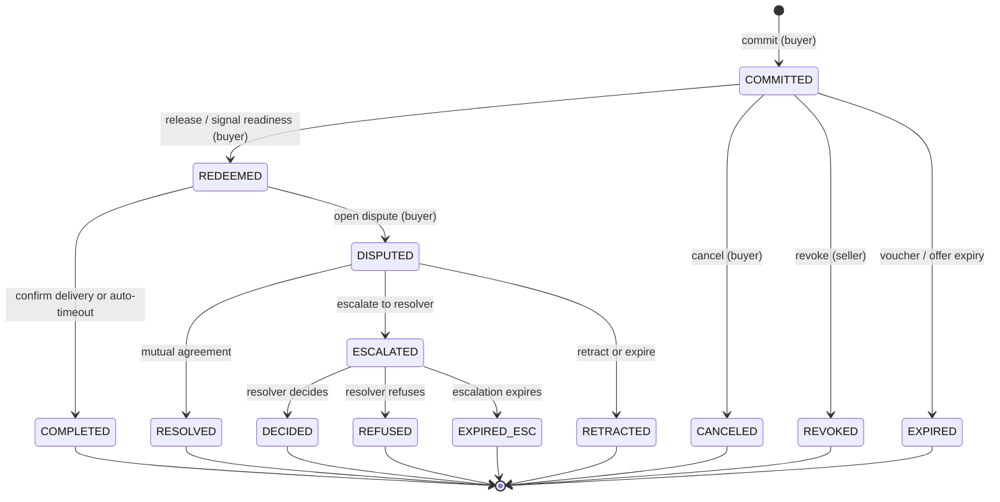
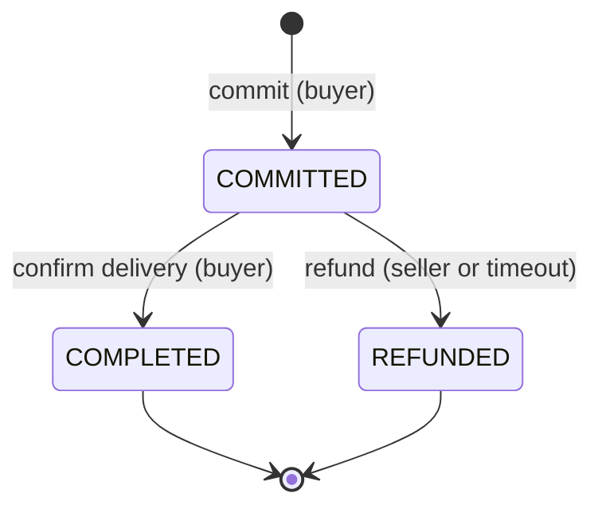

# 04 — State Machine & `nextActions`

> **Status:** detailed spec (v0.1). Defines how the protocol stays self-describing across responses and how the buyer is never locked into the seller's HTTP server.

## Self-describing state machines: one client, any escrow lifecycle

An escrow contract is not just "locked funds + one release". Different implementations encode very different lifecycle models:

- A simple two-party escrow may have only three states: COMMITTED → COMPLETED or REFUNDED.
- A voucher-based system adds a REDEEMED state between commit and final release — the buyer signals "I am ready to receive" before the seller can claim funds.
- A dispute-capable escrow adds DISPUTED, and may branch into mutual resolution, third-party arbitration, or timeout auto-release.
- A multi-party escrow (e.g. for a marketplace with an agent) may add intermediate APPROVED states.

If client SDKs hard-code a specific state machine, they break the moment they encounter a different escrow implementation. A client built for a simple two-party escrow will not know about `REDEEMED` states; a client built for Boson will not know how to drive a simpler escrow.

**The `escrow` scheme solves this by making the state machine self-describing.** The client never needs to know the implementation's state machine in advance. Instead, every server response tells the client exactly what it can do next — and how to do it across multiple fallback channels.

The `nextActions` envelope is the core enabling mechanism that makes this possible. A single generic client library can drive any conforming escrow implementation — a simple two-state contract or a full dispute-capable voucher lifecycle — without knowing the implementation in advance. New implementations with richer lifecycle models do not require client SDK updates; they emit richer `nextActions` and existing clients follow. This is what allows the `escrow` scheme to serve both simple API micropayment use cases and complex physical-goods commerce within a single wire format.

## Why every response carries `nextActions`

After commit, the buyer may need to take further on-chain steps — confirming delivery, triggering a release, opening a dispute — across multiple round-trips over hours or weeks. A protocol where the server unilaterally decides "what's next" risks two failure modes:

1. **Censorship:** if the server refuses to forward a buyer's action, the buyer is stuck.
2. **State machine mismatch:** a client that doesn't know the implementation's state machine cannot drive it correctly.

The fix: every server response carries a `nextActions` envelope that lists the **legal transitions from the current state** and **every channel through which the buyer can invoke each one**. The client needs no prior knowledge of the state machine. It reads `nextActions`, picks an action from the list, picks a channel, and invokes it. If one channel fails it falls back to the next.

This design means a single client library can drive any `escrow`-scheme implementation without a schema update — as long as the server emits correct `nextActions`, the client follows.

## Example state machine

The diagram below is an example of one escrow lifecycle — the kind used by an implementation with vouchers, redemption, and a two-level dispute path. **It is not a requirement of the `escrow` scheme.** An implementation may define fewer states, more states, or a completely different graph.



A simpler implementation might look like:



Both are valid `escrow`-scheme implementations. The client drives them identically — by reading `nextActions` from each response.

## `nextActions` envelope

Every server response (the initial 402, the 200 after commit, and every subsequent step) includes a `nextActions` envelope:

```jsonc
"nextActions": {
  "exchangeId": "12345",                  // omitted on the initial 402
  "state": "COMMITTED",                   // the current implementation-defined state; omitted on the initial 402
  "next": [
    {
      "id": "<impl>-release",             // implementation-namespaced action ID
      "channels": ["server", "facilitator", "onchain", "mcp"],
      "endpoints": { "server": "https://seller.example/escrow/release" },
      "deadline": "2026-05-11T00:00:00Z"  // optional, absolute ISO timestamp
    },
    {
      "id": "<impl>-cancel",
      "channels": ["server", "onchain"],
      "endpoints": { "server": "https://seller.example/escrow/cancel" }
    }
  ],
  "fallback": {
    "xmtp": "0xSellerXMTP...",
    "mcp":  "escrow://seller/12345",
    "onchainHints": {
      "escrowContract": "0xEscrowContract..."
      // implementation-specific method hints may be included here
    }
  }
}
```

The envelope sits at the top level of the JSON response body. For the initial 402 it's nested inside the `accepts[i].actions` field (since there's no `exchangeId` yet) — see [01-escrow-scheme.md](./01-escrow-scheme.md) §2.

### What the client does with `nextActions`

The client:

1. Reads `next[]` — the list of legal actions in the current state.
2. Selects an action by ID (based on its policy — e.g. "auto-release after delivery confirmed", "raise dispute if deadline exceeded").
3. Walks `channels[]` in preference order, invoking each until one succeeds.
4. Persists the new `nextActions` returned in the response for the subsequent step.

The client does **not** need to know what state the exchange is in, what the full state graph looks like, or how many states the implementation has. `state` is included for display and logging only.

## Action IDs

Each implementation defines its own set of action IDs and namespaces them with a stable prefix (e.g. `boson-`, `coinbase-`). Clients MUST skip action IDs with unrecognized prefixes rather than attempt dispatch — this is what allows a client to safely encounter an escrow implementation it has never seen before.

The table below shows an **example** action set for the full dispute-capable lifecycle diagrammed above. This is not a required set.

| Action ID (example) | Meaning | Typical pre-state | Typical post-state |
|---|---|---|---|
| `<impl>-commit` | Lock funds, create escrow record | (none) | COMMITTED |
| `<impl>-release` | Buyer signals readiness / acceptance | COMMITTED | REDEEMED |
| `<impl>-cancel` | Buyer cancels before release | COMMITTED | CANCELED |
| `<impl>-revoke` | Seller revokes before release | COMMITTED | REVOKED |
| `<impl>-complete` | Confirm delivery, release funds to seller | REDEEMED | COMPLETED |
| `<impl>-openDispute` | Buyer opens a dispute | REDEEMED | DISPUTED |
| `<impl>-resolveDispute` | Both parties agree on resolution | DISPUTED | RESOLVED |
| `<impl>-escalate` | Escalate to registered resolver | DISPUTED | ESCALATED |
| `<impl>-retract` | Buyer retracts dispute | DISPUTED | RETRACTED |
| `<impl>-decide` | Resolver issues decision | ESCALATED | DECIDED |

An implementation that lacks disputes would advertise only `<impl>-commit` and `<impl>-complete` (and perhaps `<impl>-refund`). The envelope structure is identical — only the action IDs and state labels differ.

## Channels

A **channel** is a transport for invoking an action. The standard registry:

| Channel | What it means | Invocation shape |
|---|---|---|
| `server` | The seller's HTTP server exposes a convenience endpoint that wraps the on-chain call. | `POST <endpoints.server>` with action-specific body. |
| `facilitator` | A third-party facilitator that submits on-chain on the buyer's behalf (gas-paying meta-tx). | `POST <facilitator>/escrow/<action>` per the facilitator's API. |
| `onchain` | Direct on-chain submission by the buyer. | `<escrowContract>.<method>(...)` per `onchainHints`. |
| `mcp` | The buyer's agent calls an escrow MCP tool. | MCP tool invocation; identifier in `fallback.mcp`. |
| `xmtp` | Out-of-band message to the seller's XMTP inbox. | XMTP message to `fallback.xmtp` with structured payload. |

`channels[]` ordering is the seller's preferred order. The client is free to override based on its own policy.

## Censorship resistance — the one invariant

The `escrow` scheme does not prescribe which states or actions an implementation must have. It does require one invariant: **for every non-terminal state, at least one buyer-reachable `onchain` channel MUST exist in `nextActions`**.

This means the buyer can always advance the exchange without the seller's cooperation. A server that withholds endpoints, returns garbage `nextActions`, or goes offline does not strand the buyer — the client falls through to the `onchain` channel using `onchainHints`.

This is a stronger guarantee than pure authorization-based approaches, where the buyer's only fallback is waiting for an authorization timeout to expire before funds become reclaimable. In the `escrow` scheme, the buyer can take affirmative action — open a dispute, cancel, escalate to a resolver — at any point during the exchange, without waiting and without anyone's cooperation.

## Server-side derivation

The server derives `nextActions` from the current exchange state — it does not curate the list by hand:

```ts
import { deriveNextActions } from "x402-escrow-actions";

const exchange = await escrowClient.exchanges.get(exchangeId);
const nextActions = deriveNextActions(exchange, {
  channels: serverConfig.advertisedChannels,   // e.g. ["server", "facilitator", "onchain", "mcp"]
  endpoints: serverConfig.endpoints,            // map of action-id → server URL
  fallback: serverConfig.fallback,              // xmtp / mcp / onchainHints
});
```

`deriveNextActions` reads `exchange.state`, looks up legal transitions in the implementation's action table, applies deadline math, and stamps each entry with the configured channels.

## Client-side execution

```ts
import { performAction } from "x402-escrow-client";

const result = await performAction(nextActions, "<impl>-openDispute", {
  payload: { ... },
  channelOrder: ["server", "facilitator", "onchain", "mcp"],
  signer,
});
// result = { channelUsed: "onchain", txHash: "0x..." }
```

`performAction` walks `channelOrder`, invoking each channel's adapter until one returns success. On final failure it throws with all per-channel errors attached. The caller identifies the action by its ID from the `nextActions` envelope — it never references a state name or a contract method directly.

## Versioning

New actions and states can be added to an implementation without breaking existing clients: clients ignore unknown action IDs (unrecognized prefix → skip). New channels extend the registry without breaking old clients — they skip unknown channels and fall back to known ones. The `state` string is treated as opaque by generic clients; only implementation-specific clients interpret it.

## Open items

- **Deadlines:** absolute ISO timestamps in `deadline` are computed from on-chain durations + commit timestamp. Clock skew tolerance: 30s.
- **Multi-action atomicity:** some actions (e.g. mutual dispute resolution) require both buyer and seller signatures. The envelope advertises the action; coordination of the dual-signature collection is implementation-defined.
- **Per-channel priority hints from the seller** (e.g. "prefer my MCP over my server"): deferred to v2.
